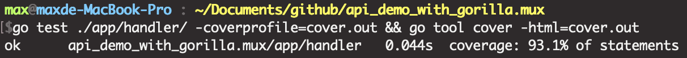
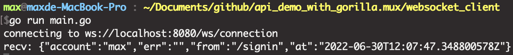
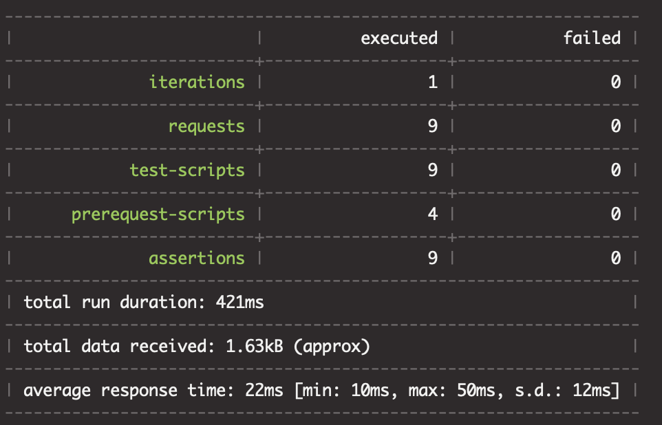
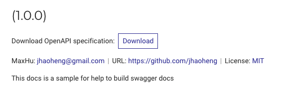

# API demo
- 使用 Golang 的框架 gorilla/mux framework
- 使用 RS256 來產生 keypair, 透過 JWT 進行認證
- 使用 mock, 來達成 api unit test
- 使用 swagger 來產生 API 文件
- 使用 postman/newman 自動化測試 APIs
- Serivce securities
    - HTTPS
    - CSRF
    - JWT Authorization
    - XSS protection
    - HSTS Protection
    - Forbidden to show nginx's version
    - SQL injection

# 版本
- golang 1.17.11
- gorilla/mux, v1.8.0
- gorm, v1.21.11
- postman, collection v2.1, newman, 5.3.2
- Docker version 20.10.6, build 370c289
- docker-compose version 1.29.1, build c34c88b2

# Run API Unit Test
1. `go test ./app/handler/ -v -cover`
2. `go test ./app/handler/ -coverprofile=cover.out && go tool cover -html=cover.out`

# 本地執行 API Service
1. 產生 JWT 用於驗證的 RS256 keypair, 在本地端, `make key`
    - If cloud deploy, don't use it, load key from cloud storage, ex: `AWS Secret Manager`, `AWS Parameter Store`
2. `docker-compose up -d && docker logs -f app`

# websocket
1. 執行本地 API service
2. Run the client, `cd websocket_client && go run main.go`
    - 執行 api signin, 得到通知

# Postman/Newman, 執行自動測試
1. 執行本地 API service
2. `make test`
3. result 可整合 aws codebuild 的 report

# swagger, 產生文件
- swagger info
    - version: v0.27.0
    - commit: 43c2774170504d87b104e3e4d68626aac2cd447d
    - [github](https://github.com/go-swagger/go-swagger)
    - [install](https://goswagger.io/install.html)
- `swagger generate spec -w ./swaggerdoc -o ./swagger.json`
- 產生文件網站: 
    - `swagger serve swagger.json`
    - `swagger serve -F swagger swagger.json`

